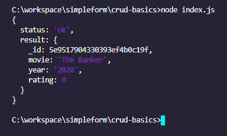
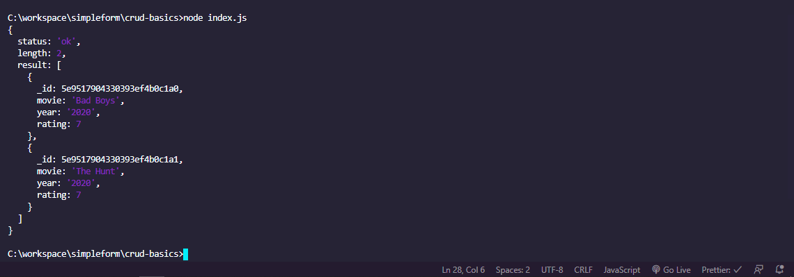
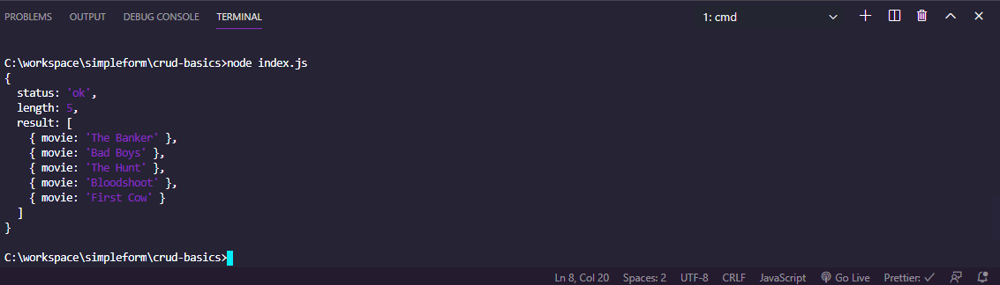
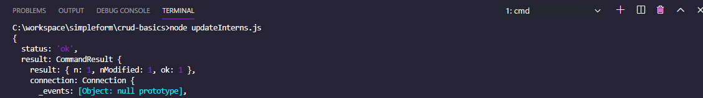

## A simple node.js MongoDB CRUD Operations

# myMovies in Interns.js file

# 

# (a) find the first document in myMovies collection

# 

# (b) find movies with rating 7

# 

# (c) with projection query return only movies title ...

# 

# (3) update the movie "The Banker"

# 

<!-- #  -->
